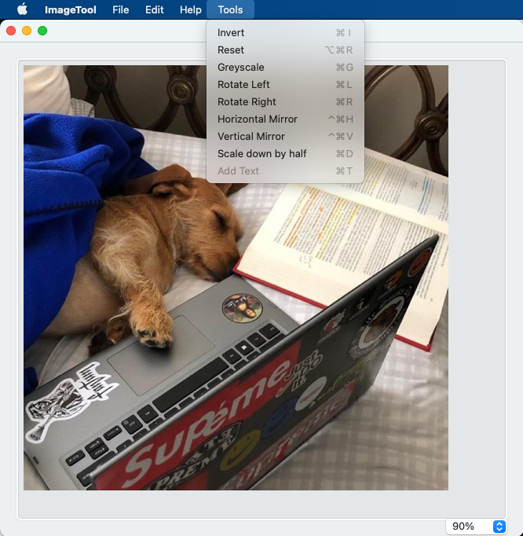
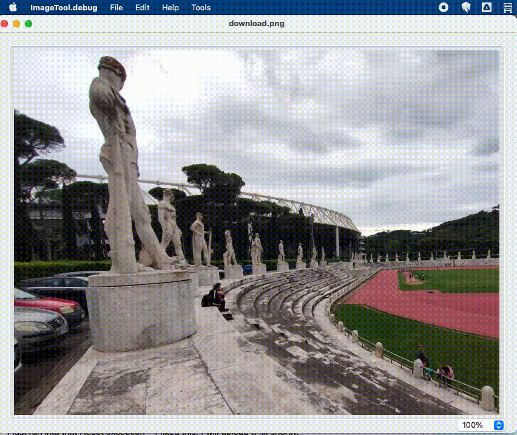
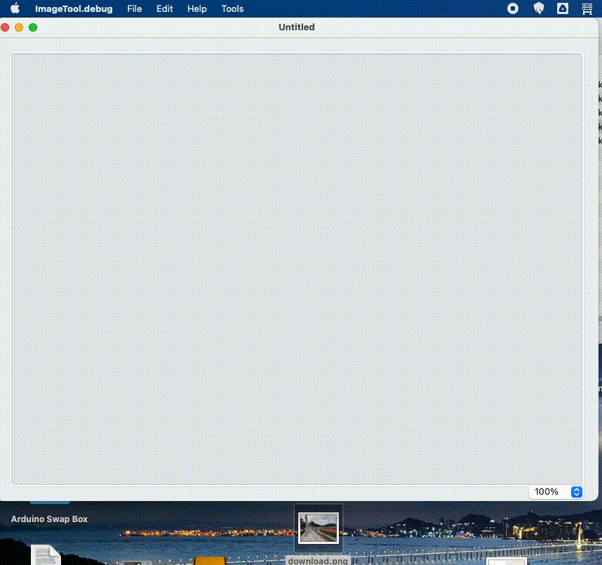
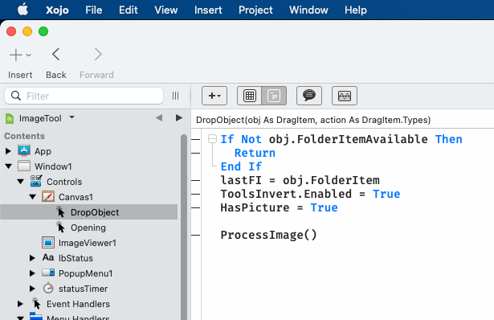
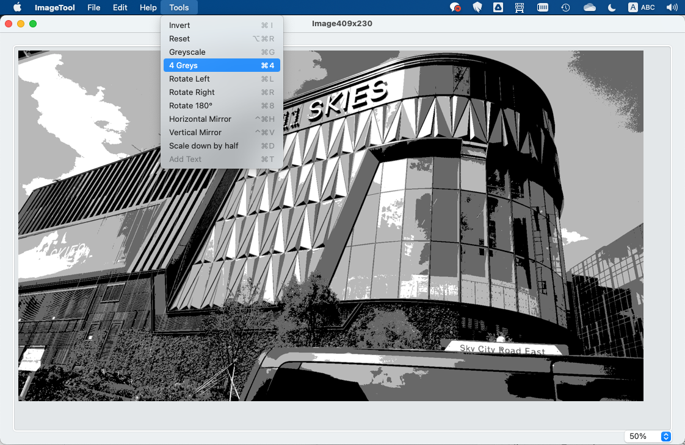

# ImageTools

I wrote the ImageTools for REALBasic a REAL long time ago. A client of mine used it in one of the apps I wrote for them. Then after awhile, between personal issues and, well, life, I forgot about it – and many other projects. But a thread on the Xojo forum enquired about this library, so I decided, when I finally discovered it, that I could modernize it and revive. So here it is in all its glory... :-)

## Methods

* `Brightness. extends pix as picture, variance as integer` 
Adjusts brightness via .Transform ==> variance (positive or negative). Checks for negative values and values above 255.
* `DrawPix. extends pix2 as picture, pix as picture` 
Draws pix into pix2
Not really useful. Just an exercice in unrolling loops
Check also the variant with partial draw
* `DrawPix. extends pix2 as picture, pix as picture,X as integer, Y as integer` 
Draws a part of pix into pix2 ==> x = left, y = top (width = width of pix; height = height of pix)
Not really useful. Just an exercice in unrolling loops
* `Grayscale. extends pix as Picture` 
Converts the image To grayscale. I am following a formula I found, I think, on IBM's web site...
For another, slightly faster method, see greyscale below.
* `Greyscale. extends pix as picture` 
Converts the image To grayscale
This is the plainest method possible: average out r/g/b...
For another, slightly more refined method, see grayscale above.
This version features loops only partly unrolled.
See grayscale for fully unrolled loops.
* `HMirror. extends pix as picture` 
Horizontal mirror.
see also vertical mirror
Quite fast for pure RB code... If I may say so myself ;-)
* `Invert. extends pix as picture` 
Inversion. each channel is set to 255-value.
* `Resize. pix as picture, w as integer, h as integer` 
wrapper to. DrawPicture
Normally produces a good quality image, but there have been complaints on Windows.
Two ratios are computed to determine how much to resize the picture (non-square image).
The highest ratio is used.
* `RGBvariation. extends pix as picture, v1 as integer, v2 as integer, v3 as integer` 
A variant of Brightness.
Instead of applying the same variance To the three channels, separate values are passed for r/g/b.
* `Rotate180. extends pix as Picture` 
180° rotation
* `Rotate90ccw. extends pix as picture` 
270° rotation, aka counter-clockwise
Contrary to 180°, we have to return a new image:
just working on pix will produced a truncated image, since we can't resize pix now...
* `Rotate90cw. extends pix as picture` 
90° rotation, aka clockwise
Contrary to 180°, we have to return a new image:
just working on pix will produced a truncated image, since we can't resize pix now...
* `ScaleDouble. extends pix as picture` 
Using bicubic interpolation, the image is doubled.
Results are so-so..
* `ScaleDownByHalf. extends pix as picture` 
Using bicubic interpolation, the image is scaled down to half (actually quarter: half height, half width).
Results are quite good, but a tad slow to my taste.
* `SuppressBlue. extends pix as picture` 
A very simple and powerful example of .Transform.
The blue channel is wiped out.
* `SuppressGreen. extends pix as picture` 
A very simple and powerful example of .Transform.
The green channel is wiped out.
* `SuppressRed. extends pix as picture` 
A very simple and powerful example of .Transform.
The red channel is wiped out.
* `Vmirror. extends pix as picture` 
Vertical mirror.
See also Horizontal mirror

## Demo app
The app accepts drag'n'drop in and out of the app, as well as copy/paste. Some of the library's functions are present in the Tools menu. Not a very useful app yet, but enough for a demo...

## Update 2023/10/12

Following reports on the Forum, I found a bug in Reset (which extended farther than that actually). An image copied from the clipboard didn't have a FolderItem, so that broke when the code was looking for one. Clipboard images now have a FolderItem in the Temporary special folder.

I was told Greyscale and Invert didn't work, they seem to:

Also, I was told that drag'n'drop wasn't implemented: I BEG YOUR PARDON.

## Update 2023/10/13

* Added a 4-level greyscale function. I need this for my retro-computing endeavours...
* On opening the picture, and resizing the window, if the image is too big, the app calculates the ideal view size.

